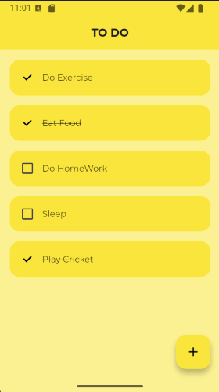

# ToDo App

## Overview
This is a 'Todo App' build in Flutter.

## Getting Started
### Prerequisites
Ensure you have the following installed:
- [Flutter SDK](https://flutter.dev/docs/get-started/install)
- [Dart SDK](https://dart.dev/get-dart)
- Android Studio or Visual Studio Code
- Xcode (for iOS development)

### Installation
1. Clone the repository:
   ```sh
   git clone https://github.com/vedantvisoliya/Flutter-Todo-App.git
   cd todo_app
   ```
2. Install dependencies:
   ```sh
   flutter pub get
   ```
3. Run the project:
   ```sh
   flutter run
   ```
   
## Contribution
Contributions are welcome! Please open an issue or submit a pull request.

## ScreenShots

